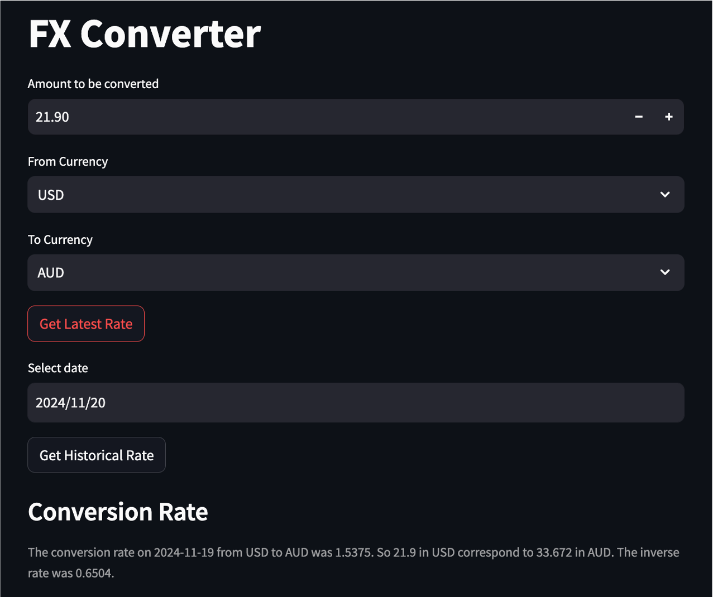

# **Currency Converter Web Application**
A web application which performs currency conversion using data fetched from an open-source API


## **Description**

This project requires to develop a web application which helps users facilitate currency conversion. This tool would be beneficial for both individuals and organizations who need to work with exchange rates, by allowing them to access to conversion rates between two specified currencies in the latest date or specific date. 
The data was fetched from an open-source API provided by Frankfurter. In this project, Streamlit was exploited to create the user-friendly Web Application. 

## **Project Structure**
- `app.py`: main Streamlit python script used for managing users’ inputs and displaying results
- `api.py`: python script that consists of code for making API calls
- `frankfurter.py`: python script that consists of the functions used for calling relevant Frankfurter endpoints and extracting information.
- `currency.py`: python script that contains the function used for formatting the results to be showed in the app.
- `README.md`: markdown file 


## **Set up and Installation**

### Prerequisites
Ensure you have the following installed on your system:
- Python (version 3.9 or later)
- Streamlit (ensure compatibility with your Python version)
- Git (if cloning the repository from GitHub)

### Steps to set up the Application
1. Install Git: If Git is not already installed on your system, download and install it from [Git's official website](https://git-scm.com/). Follow the installation instructions for your operating system.
  
2. Clone the repository:
- Open a terminal or command prompt and navigate to the directory where you want to download the project.
- Type the following command to clone the repository from GitHub

```
git clone https://github.com/phuonganh-38/currency-converter-web-app.git
cd currency-converter-web-app
```

*Note*: If you prefer downloading the project as a ZIP file, click the green "Code" button on the GitHub page and select "Download ZIP." 

3. Start the streamlit app by running:
```
streamlit run app.py
```

## **Environment details**
- Python version: 3.11.3
- Streamlit version: 1.26.0


## **Screenshot**

Here's a preview of the Currency Converter Web App: 


